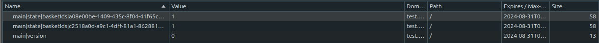

# zustand-cookie-storage

[](https://www.npmjs.com/package/zustand-cookie-storage)
[](https://www.npmjs.com/package/zustand-cookie-storage)
[](https://github.com/nanotexnolagiya/zustand-cookie-storage/actions)

`zustand-cookie-storage` is a plugin for [Zustand](https://github.com/pmndrs/zustand) that allows you to persist your store's state in cookies. This package makes it easy to maintain state across sessions and browser tabs.

## Features

- **Persist Zustand State in Cookies**: Save and load Zustand state from cookies automatically.
- **Customizable**: Configure cookie attributes like `expires`, `path`, `secure`, and more.
- **Server-Side Rendering Friendly**: Ideal for use in SSR frameworks such as Next.js.
- **Lightweight**: Minimalistic design with a small footprint.

## Installation

Install the package via npm or yarn:

```bash
npm install zustand-cookie-storage
# or
yarn add zustand-cookie-storage
```

## Example
```javascript
import { create } from "zustand";
import { createJSONStorage, persist } from "zustand/middleware";
import { cookieStorage } from "zustand-cookie-storage";

const useMainStore = create(
  persist(
    (...args) => ({
      ...locationSlice(...args),
      ...profileSlice(...args),
    }),
    {
      name: "main",
      storage: createJSONStorage(() => cookieStorage),
      partialize(state) {
        return {
          basketIds: state.basketIds
        };
      },
    }
  )
);
export default useMainStore;
```
---

